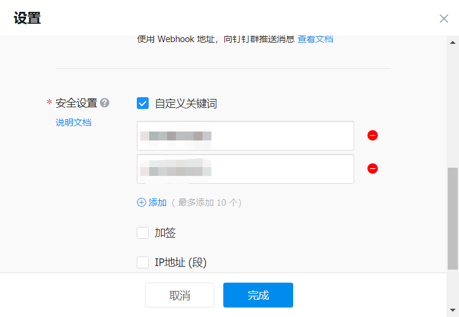
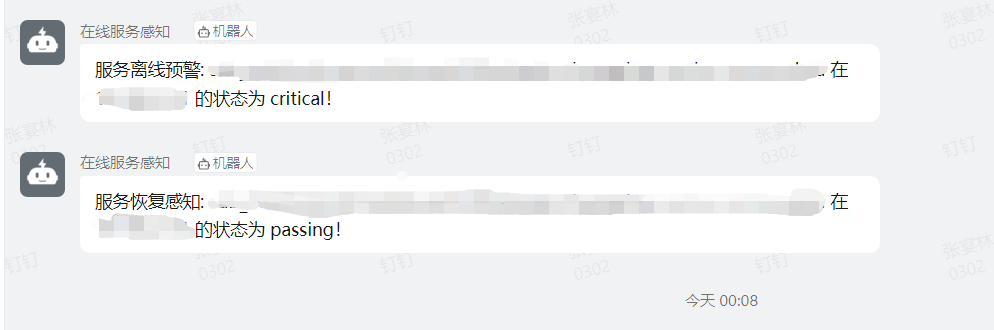

# ConsulNotify
这是一个用于consul注册中心异常服务的报警工具，使用python进行构建并在特定的时间间隔内完成异常服务的报警。

## 安装
该工具请在下载后修改`config.yaml`文件中的相关参数，包括配置consul服务器的信息，钉钉机器人的url信息，示例如下：
```yaml
consul:
  consul_url: "127.0.0.1"
  consul_port: 8500

notify:
  dingding_url: "https://oapi.dingtalk.com/robot/send?access_token=xxx"
  secret: xxx

running:
  scheduleIntervel: 10 #per minutes
  maxNotify: 2
```
安装依赖包：
```shell
pip3 install -r requirements.txt
```

## 配置通知相关配置信息
### 钉钉
在配置文件中设置钉钉的url，机器人创建方式  [参考链接](https://open.dingtalk.com/document/robots/custom-robot-access) 。  
设置机器人发生消息关键词： 

## 运行
请使用如下方式运行工具：
```shell
python3 main.py
```
运行结果示例如 