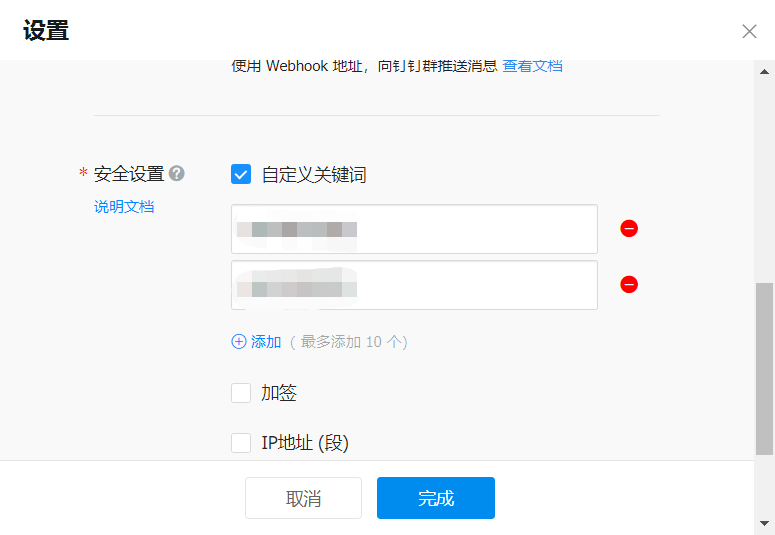
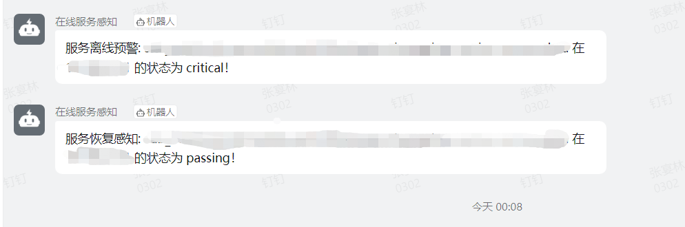

# ConsulNotify
ConsulNotify is a tool used for alerting abnormal services in the Consul registration center. It is built using Python and completes the alert of abnormal services within a specific time interval.

## Installation
Please modify the parameters in the config.yaml file after downloading the tool, including the information to configure the Consul server and DingTalk robot URL. Here's an example:
```yaml
consul:
  consul_url: "127.0.0.1"
  consul_port: 8500

notify:
  dingding_url: "https://oapi.dingtalk.com/robot/send?access_token=xxx"
  secret: xxx

running:
  scheduleIntervel: 10 #per minutes
  maxNotify: 2
```
Install dependent packages:
```shell
pip3 install -r requirements.txt
```

## Configuration of notification-related configuration information
### DingTalk
Set the URL of DingTalk in the configuration file, and create the robot according to  [this link.](https://open.dingtalk.com/document/robots/custom-robot-access) 。  
Set the message keyword sent by the robot:  

## Running
Please run the tool using the following command:

```shell
python3 main.py
```
The running result is shown below:  